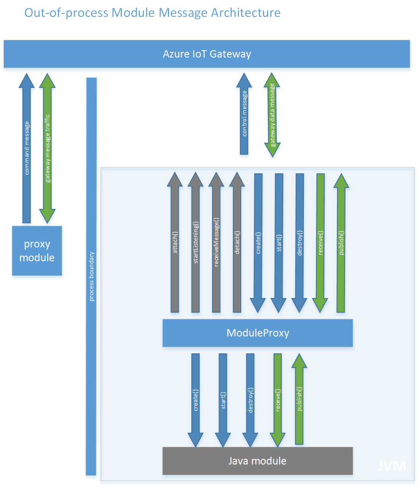
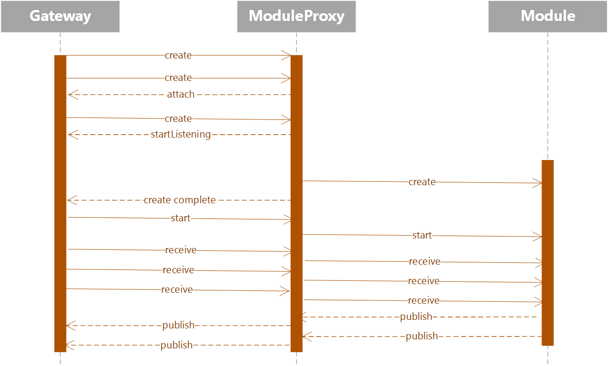

Java Out of Process Module API
==============================

Overview
--------

This document describes the API that enables communication between an out of process Java module and Azure IoT Gateway. 
An out of process module should implement `IGatewayModule` interface or extend the `GatewayModule` abstract class as it does for an in-process module, more details in [Java binding high level design](java_binding_hld.md). In addition, the API provides `GatewayModuleProxy` which is a proxy for the IGatewayModule implementation and handles the communication between the Gateway and the out of process module. 
`GatewayModuleProxy` contains the methods to *attach* a module to the Gateway, *listen* for messages and *detach* from the Gateway. 

There are two types of messages that are exchanged between the Gateway and the out of process module:

-  *control* messages that are used to signal `CREATE`, `START` and `DESTROY` of a module. These messages are always send from the Gateway to the module.
-  *data* messages which are send between modules via the Gateway.




Receive out of process messages from the Gateway
------------------------------------------------

In order to make a module to run out of process, create an instance of `GatewayModuleProxy`, pass the configuration that contains the unique identifier to attach to the Gateway and then call `attach` and `startListening`. 
Also the Gateway configuration has to be changed for that specific module to set the loader as an out of process loader and set the same unique identifier. 

``` java
interface ModuleProxy {
	public void attach();
	public void detach();
	public void startListening() ;
	public void stopListening();
	public void receiveMessage();
}
```

``` java
public class GatewayModuleProxy implements ModuleProxy {
	private ModuleConfiguration config;
	public GatewayModuleProxy(ModuleConfiguration config) {
		// implementation
	}

	@Override
	public void attach() {
		// implementation	
	}
	
	@Override
	public void detach() {
		// implementation	
	}

	@Override
	public void receiveMessage() {
		// implementation
	}

	@Override
	public void startListening() {
		// implementation
	}

	@Override
	public void stopListening() {
		// implementation
	}
}
```

Messages sequence
-----------------



The `attach` method from GatewayModuleProxy shall be called in order to be able to start receiving messages from the Gateway. After attaching to the Gateway, `startListening` method may be called to receive messages from the Gateway. This method creates a thread that listens for incoming messages from the Gateway. If the implementer of the remote module wants to control the thread creation, it may call `receiveMessage` instead of `startListening`. `receiveMessage` shall get just one message from the Gateway, to continue receiving messages a loop must be created.

The communication between the out of process module and the Gateway is done using *nanomsg* which is a socket library written in C and is going to be called from Java using JNI. 
The `GatewayModuleProxy` abstracts the communication over *nanomsg* and the module receives the messages from the Gateway as an in-process module via `receive` method.

The first message that the module should receive from the Gateway is `CREATE`. This is a blocking call that waits until `CREATE` message is received and once it received the message it calls `create` method from `IGatewayModule` implementation. 

When the module receives a `START` message from the gateway it forwards to `start` method from IGatewayModule implementation .

All *data* messages are forwarded to the `receive` method from IGatewayModule implementation.

When the module doesn't want to receive or send messages from/to the gateway it should call `detach` method from GatewayModuleProxy. The Gateway may send a `DESTROY` message that stops the listening thread and calls `destroy` method from IGatewayModule implementation.

``` java
public class ModuleConfiguration {
	private String identifier;
	private Class<? extends IGatewayModule> clazz;
    
	// implementation
}
```

`ModuleConfiguration` class contains the details required to attach to the Gateway: the identifier which is the unique id that must be the same as *outprocess_module_control_unique_id* used in the Gateway configuration of the module.
clazz represents the IGatewayModule implementation class.

Example how the loader should be configured in Gateway for out of process module:

``` json
"modules" : [
{ 
    "name" : "outprocess_module",
    "loader" : {
        "name" : "outprocess"
        "entrypoint" : {
            "activation.type" : "none",
            "control.identifier" : "outprocess_module_control_unique_id",
            "message.identifier" : "outprocess_module_message_unique_id",
        }
    }
    "args" : {...}
}
]
```

Send out of process messages to the Gateway
-------------------------------------------

When the module method `create` gets callled, one of the arguments is a broker object which can be used to send messages to the Gateway by calling `publishMessage`. 
For the out of process module a `BrokerProxy` instance is going to be passed as the broker argument which will handle sending messages to the out of process Gateway.